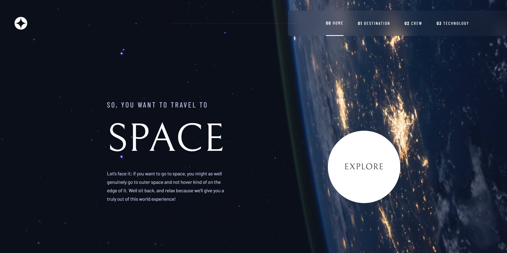

<h1 align="center">Frontend Mentor - Space tourism website </h1>

---

## Be Welcome!

Thanks for checking out this front-end coding challenge.

You can check the result through this link: [Space tourism](https://space-tourism-nextjs.vercel.app/)

[Frontend Mentor](https://www.frontendmentor.io) challenges help you improve your coding skills by building realistic projects.

**To do this challenge, you need a understanding of HTML, CSS and Javascript.**

## The challenge

Users should be able to:

- View the optimal layout for each of the website's pages depending on their device's screen size
- See hover states for all interactive elements on the page
- View each page and be able to toggle between the tabs to see new information

## Links

- Live Site: [Space tourism](https://space-tourism-nextjs.vercel.app/)

## Built with

- [React](https://reactjs.org/) - JS library
- [Next.js](https://nextjs.org/) - React framework
- [Chakra UI](https://chakra-ui.com/) - For structure and styles 

## Author

- Frontend Mentor - [@NavarKartalian](https://www.frontendmentor.io/profile/NavarKartalian)
- Linkedin - [Navar Kartalian](https://www.linkedin.com/in/navar-kartalian-784637206/)